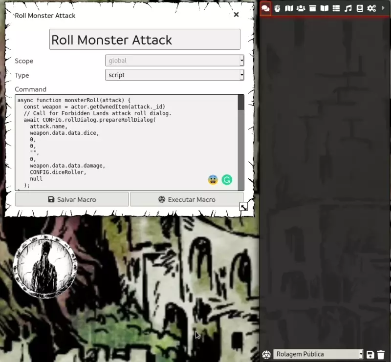

# foundryvtt-macros
Foundry VTT Macros created by me!

## Forbidden Lands Macros

This macro rolls a random attack based on existing attacks from the token sheet of the monster.

**Requeriments**:

- [Forbidden Lands System](https://github.com/fvtt-fria-ligan/forbidden-lands-foundry-vtt).

[Roll Monster Attack.](src/forbbiden-lands/roll-monster-attack.js)

